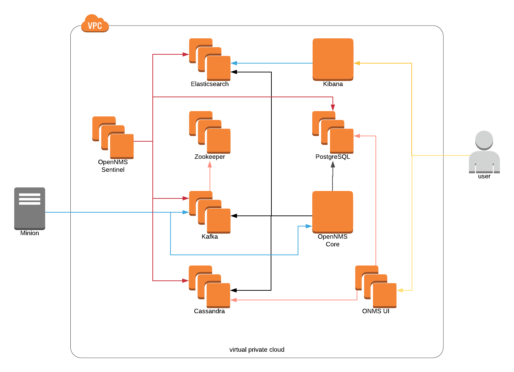

# OpenNMS Drift deployment in AWS for testing purposes



## Installation and usage

* Make sure you have your AWS credentials on `~/.aws/credentials`, for example:

```INI
[default]
aws_access_key_id = XXXXXXXXXXXXXXXXX
aws_secret_access_key = XXXXXXXXXXXXXXXXXXXXXXXXXXXXXXXXXX
```

* Install the terraform binary from [terraform.io](https://www.terraform.io)

* Install VirtualBox from [virtualbox.org](https://www.virtualbox.org)

* Install Vagrant from [vagrantup.com](https://www.vagrantup.com)

* Tweak the common settings on `vars.tf`, specially `aws_key_name` and `aws_private_key`, to match the chosen region.

* Execute the following commands from the repository's root directory (at the same level as the .tf files):

```SHELL
terraform init
terraform plan
terraform apply
```

* Generate the `/etc/hosts` file for the Minion system using `resources/minion/generate-hosts-files.pl`

* Initialize the Minion VM using Vagrant:

```SHELL
cd resources/minion
vagrant up
```

* Enjoy!

## Requirements

* OpenNMS version 22 or newer is required. For now, the script will use the RPMs from the `features/drift` branch.

## Design

The purpose here is understand the drift architecture, not using AWS resources like RDS, SQS, etc. to deploy OpenNMS on the cloud.

For this reason, everything will live on the same subnet (a.k.a. one availability zone) with direct Internet access through an Internet Gateway. All the EC2 instances are going to have a specific private IP address, registered against a local DNS through Route 53 and a dynamic public IP, which is how the operator can connect to each instance, and the way Minion will reach the solution.

The architecture involves the following components:

* A pair of EC2 instances for ActiveMQ, configured using Network of Brokers, so OpenNMS and Minion can use it on a failover fashion, and the connection between the 2 brokers will guarrantee that all the messages will be delivered.

* A cluster of 3 EC2 instances for Cassandra/Newts.

* A cluster of 3 EC2 instances for Zookeeper (required by Kafka). 

* A cluster of 3 EC2 instances for Kafka.

* A cluster of 3 EC2 instances for Elasticsearch.

* An EC2 instance for PostgreSQL.

* An EC2 instance for the central OpenNMS.

* An EC2 instance for Kibana.
 
